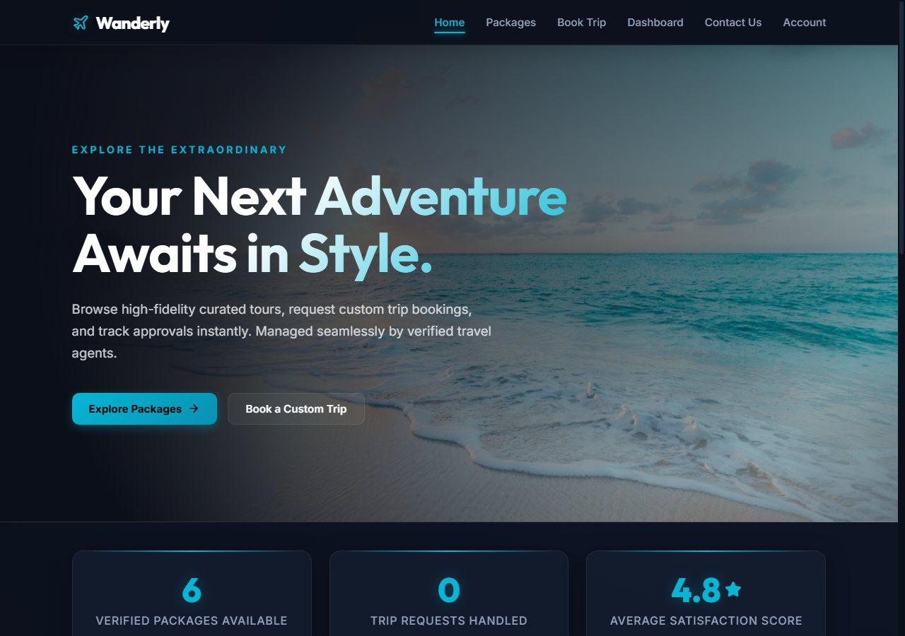
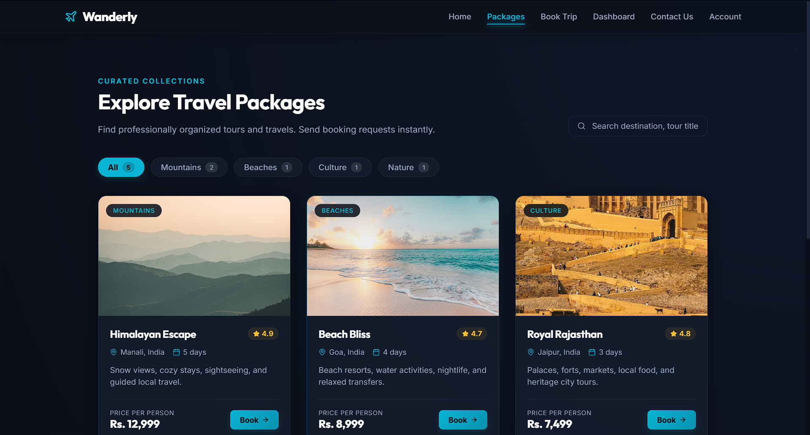
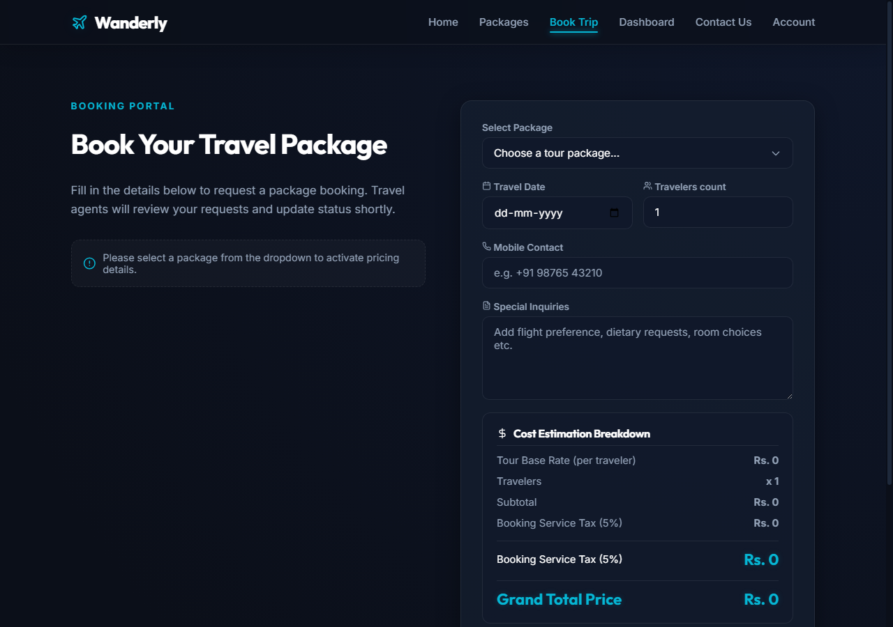
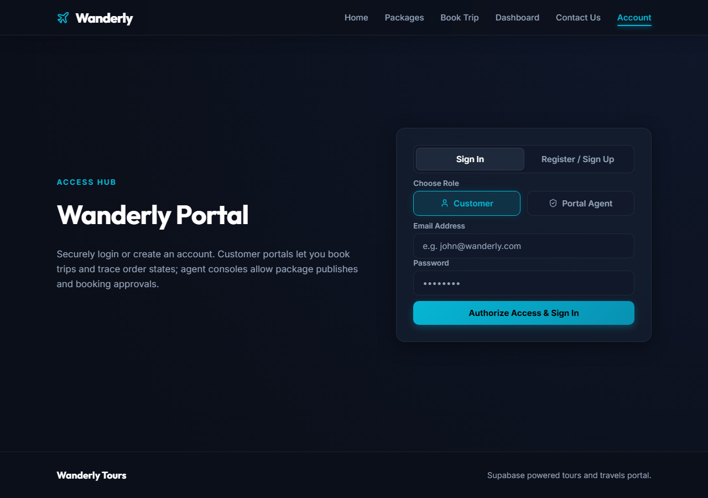
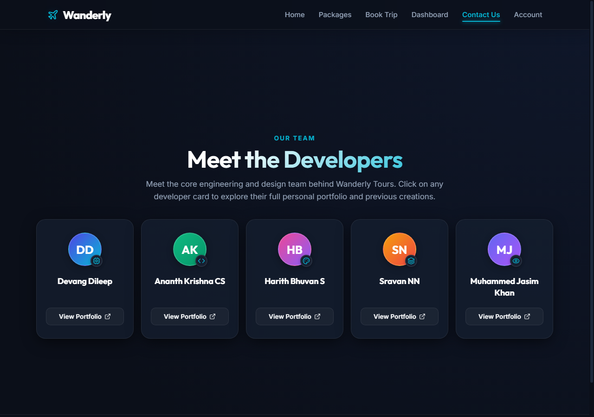

# 🌍 Wanderly Tours & Travels

**Live URL:** [https://ui-project-482s.vercel.app/](https://ui-project-482s.vercel.app/)

Wanderly is a modern, high-fidelity tours and travels web portal built with **React** and backed by **Supabase**. It offers a seamless experience for customers to browse curated holiday packages, make booking requests, and track approvals, while allowing travel agents to manage package listings and approve bookings.

---

## 🚀 Key Features

### For Customers
- **Curated Packages:** Search and filter tour packages by category (Mountains, Beaches, Nature, Culture).
- **Custom Booking Requests:** Book trips with custom inputs (dates, guest counts, notes).
- **Interactive Tracking:** View and track the status of trip booking requests in real time.

### For Travel Agents
- **Inventory Management:** Full CRUD operations on packages (Create, Read, Update, Delete) from a secure dashboard.
- **Workflow Approvals:** Accept, decline, or review pending customer booking requests.
- **Dynamic Stats Panel:** Real-time metrics showing package counts, active bookings, and customer satisfaction scores.

---

## 💻 Technology Stack

- **Frontend:** React (v19) & Vite (v7)
- **Styling:** Vanilla CSS (Glassmorphism design system)
- **Database & Auth:** Supabase (PostgreSQL with Row-Level Security)
- **Icons:** Lucide React

---

## 📂 Project Structure

```text
ui-project/
├── screenshots/
│   ├── contact.png
│   ├── home.png
│   ├── login.png
│   ├── packages.png
│   └── request.png
├── src/
│   ├── components/
│   │   ├── Footer.jsx
│   │   └── Navbar.jsx
│   ├── css/
│   │   ├── agent.css
│   │   ├── contactme.css
│   │   ├── global.css
│   │   ├── home.css
│   │   ├── login.css
│   │   ├── navbar.css
│   │   ├── packages.css
│   │   └── request.css
│   ├── lib/
│   │   └── supabase.js
│   ├── pages/
│   │   ├── ContactPage.jsx
│   │   ├── DashboardPage.jsx
│   │   ├── HomePage.jsx
│   │   ├── LoginPage.jsx
│   │   ├── PackagesPage.jsx
│   │   └── RequestPage.jsx
│   ├── App.jsx
│   ├── data.js
│   └── main.jsx
├── supabase/
│   └── schema.sql
├── .env.example
├── .gitignore
├── index.html
├── package.json
├── package-lock.json
├── README.md
└── vercel.json
```

---

## 👥 Meet the Developers

This project was engineered and designed by:

| Developer Name | Roll Number | Portfolio |
| :--- | :--- | :--- |
| **Devang Dileep** | `AM.SC.U4CSE25213` | [View Portfolio 🌐](https://devangdileep.github.io/personal-portfolio/) |
| **Ananth Krishna CS** | `AM.SC.U4CSE25203` | [View Portfolio 🌐](https://ananth2007.github.io/project-portfolio/) |
| **Harith Bhuvan S** | `AM.SC.U4CSE25222` | [View Portfolio 🌐](https://harith10069.github.io/portfolio-website/) |
| **Sravan NN** | `AM.SC.U4CSE22251` | [View Portfolio 🌐](https://thesvnverse.github.io/portfolio-website/) |
| **Muhammed Jasim Khan** | `AM.SC.U4CSE25333` | [View Portfolio 🌐](https://jasimjaskerkhan-a11y.github.io/MY_PORTFOLIO/) |

---

## 📸 Screenshots

### Home Page


### Holiday Packages


### Booking Request Form


### User Account Login


### Contact & Developers Showcase


---

## 🛠️ Setup & Installation

Follow these steps to run Wanderly locally:

### 1. Install Dependencies
```bash
npm install
```

### 2. Environment Configuration
Create a `.env` file in the root directory (based on `.env.example`) and add your Supabase credentials:
```env
VITE_SUPABASE_URL=your_supabase_project_url
VITE_SUPABASE_ANON_KEY=your_supabase_anon_public_key
```

### 3. Database Setup
Execute the SQL statements inside `supabase/schema.sql` in your Supabase SQL Editor. This sets up:
- The `profiles`, `packages`, and `orders` tables.
- RLS (Row-Level Security) policies for customers and agents.
- Automatic profile creation triggers for user signups.

### 4. Run Local Development Server
```bash
npm run dev
```
Open [http://localhost:5173](http://localhost:5173) in your browser.
